# Embarque Tenares (Front-Facing Website)

A mobile and desktop-friendly website for clients to track packages and find the latest prices, frequently asked questions, business policies, and location information using VueJS / Quasar Framework.

## Table of Contents

- [Installation](#installation)
- [Usage](#usage)
- [Screenshots](#screenshots)
- [Acknowledgments](#acknowledgments)
- [Contact](#contact)
  A Vue/Quasar version of the Embarque Tenares app## Installation

## Installation

To set up and install the project, you'll need the following:

- [GitHub CLI](https://github.com/git-guides/install-git)
- [npm](https://docs.npmjs.com/) or [yarn](https://classic.yarnpkg.com/en/docs/install/)
- Dependencies: axios, @intlify/vue-i18n-loader, dotenv, firebase, process, quasar, @quasar/extras, @quasar/icongenie, serve, surge, vue, vue-router, vuex

Run the following commands in your terminal:

1. Clone the repository: `git clone https://github.com/your-username/embarque-tenares.git`
2. Navigate to the project directory: `cd embarque-tenares`
3. Install dependencies: `npm install` or `yarn install`
4. Build the project: `quasar build`

## Usage

<b>Development</b>

Run the following command to start the development server:

```bash
quasar dev
```

<b>Production</b>

Visit [embarquetenares.com](https://embarquetenares.com) to interact with the project.

## Screenshots

<b> Desktop </b>

<div style="display: flex; justify-content: space-between;">
  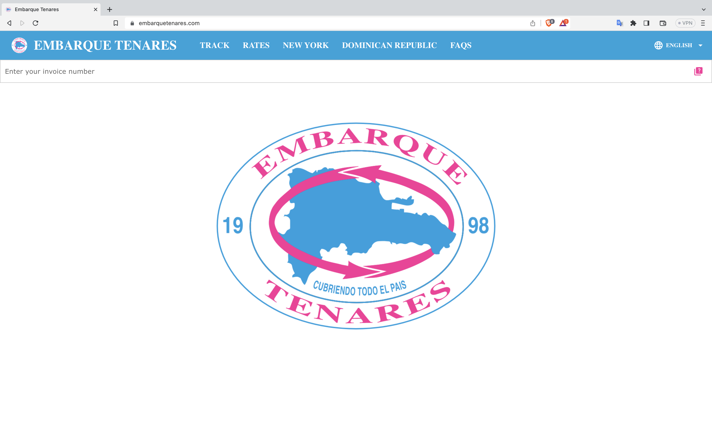
  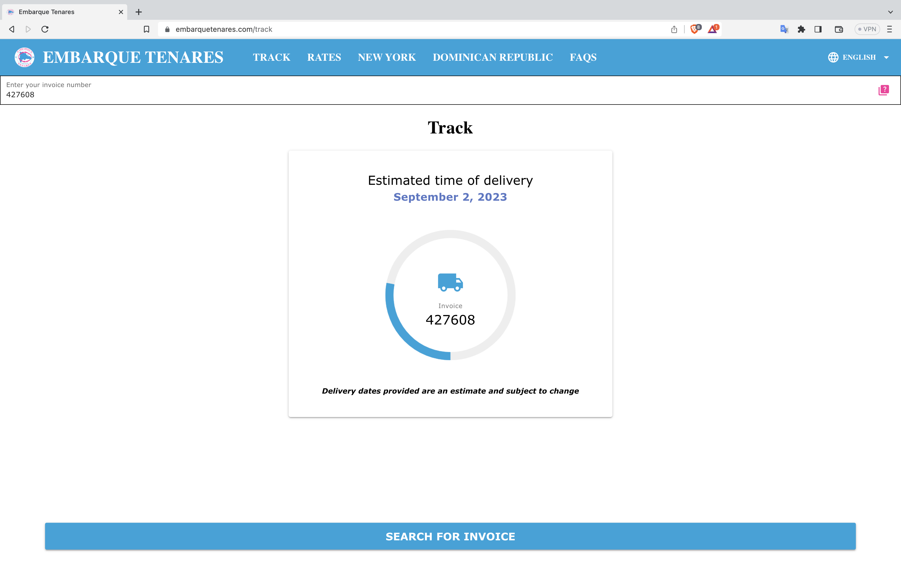
  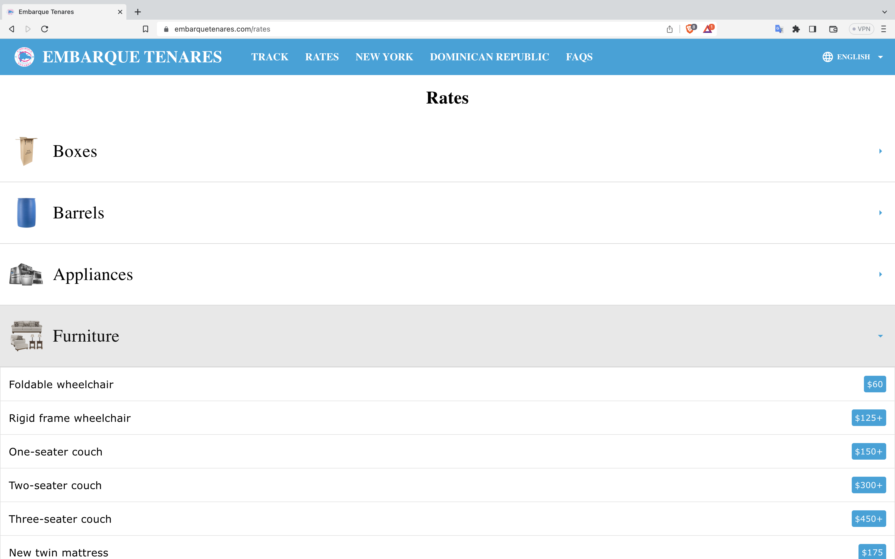
  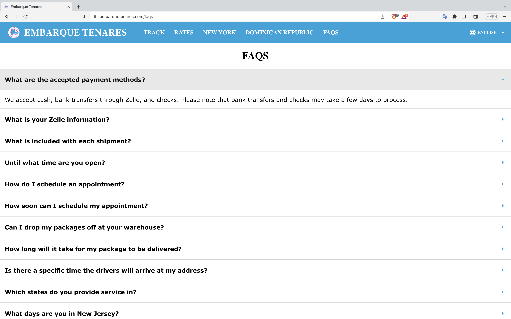
  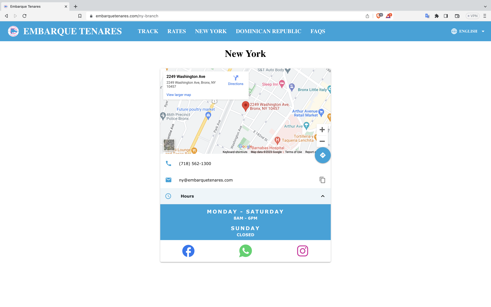
  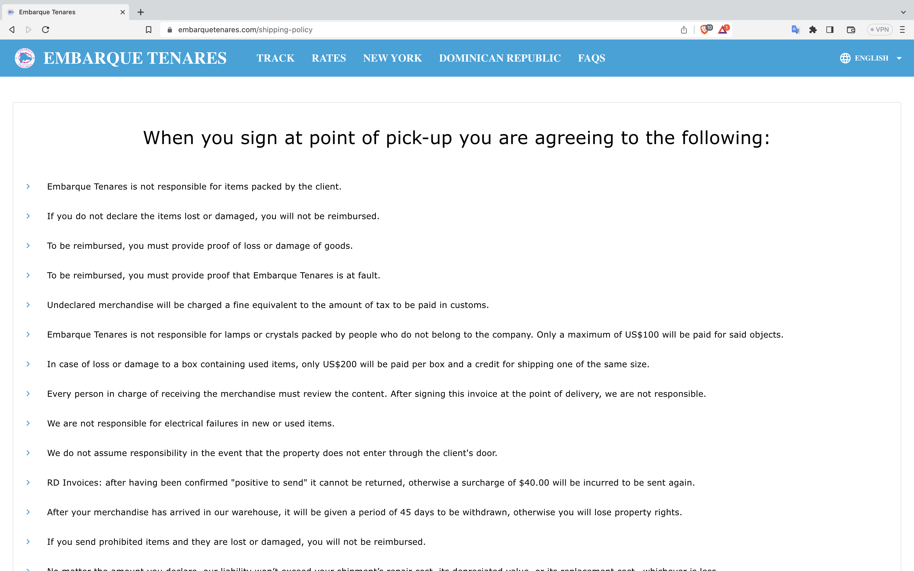
</div>

<b> Mobile </b>

<div style="display: flex; justify-content: space-between;">
  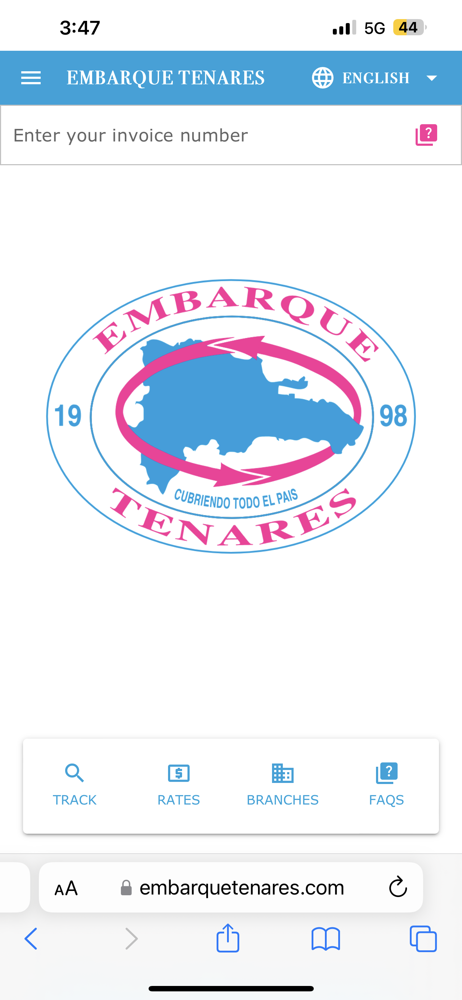
  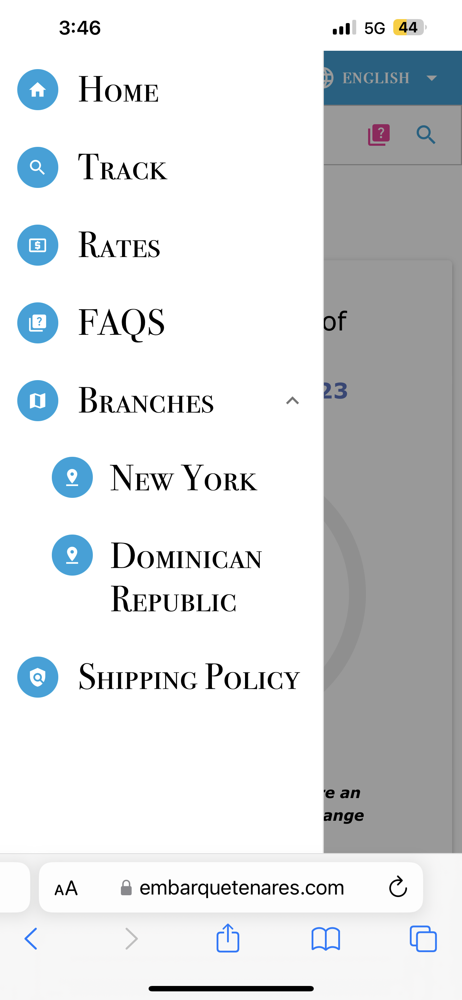
  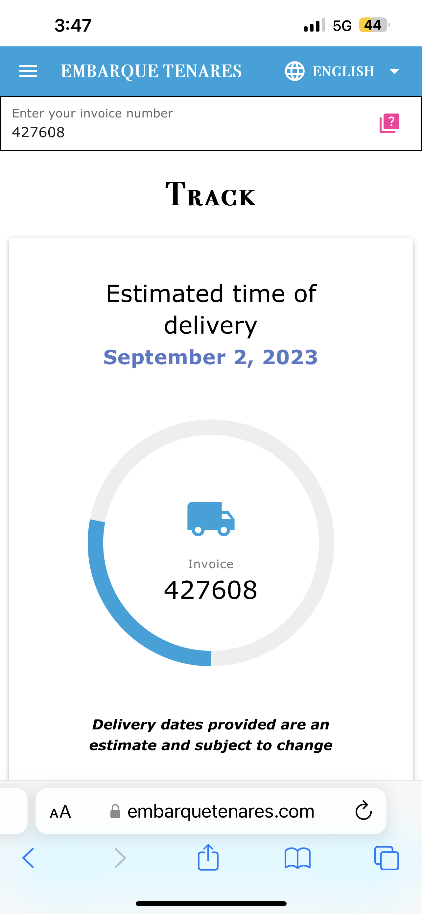
  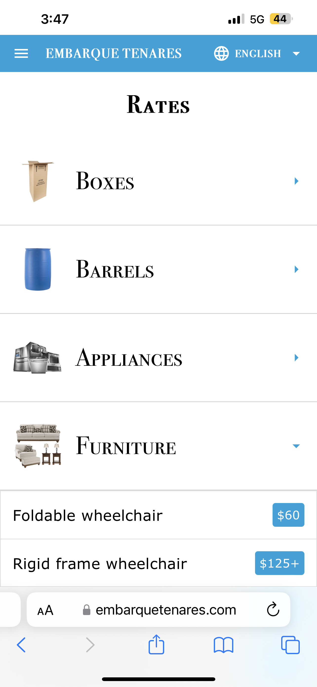
  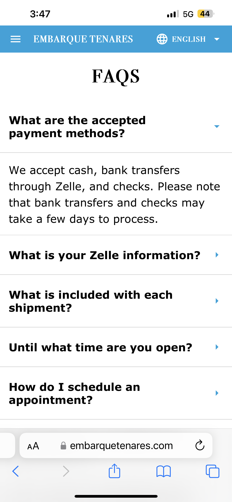
  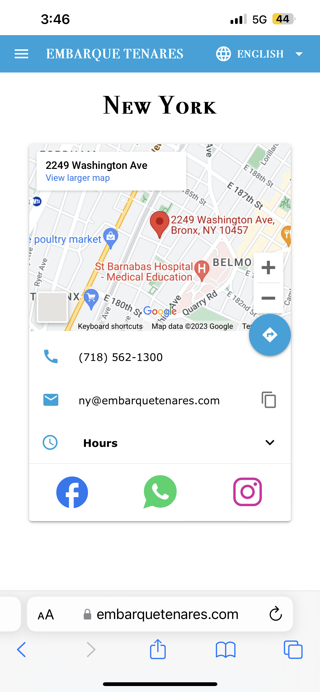
</div>

## Acknowledgments

I would like to acknowledge the Vue.js and Quasar framework communities for their detailed documentation and powerful tools.

## Contact

For questions or feedback about the project, feel free to get in touch with me at elkingarcia.11@gmail.com.
